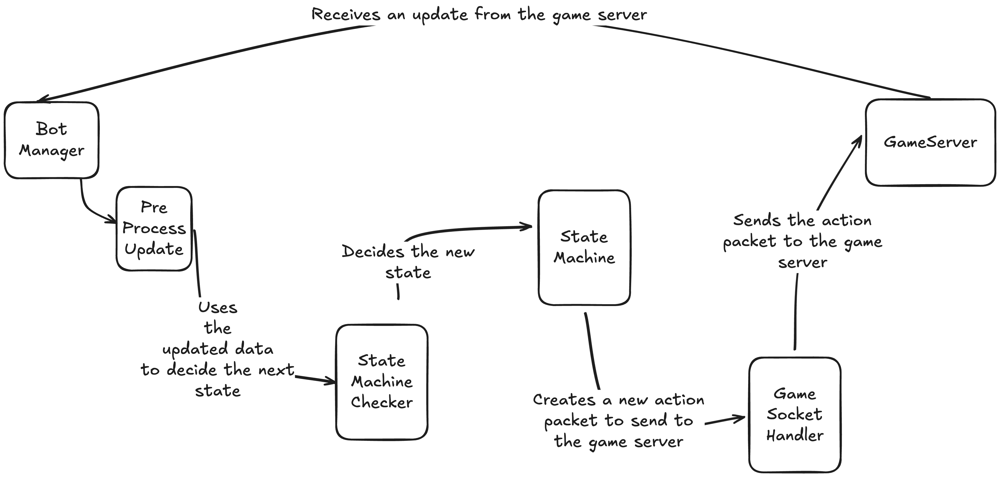
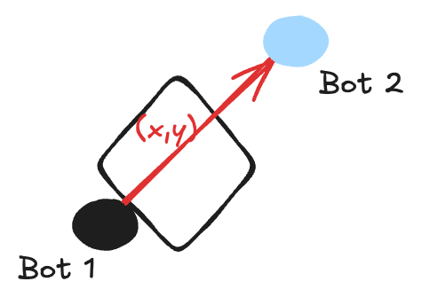

# Bots

## Bot's flow



Here's each part of the image explained

**Bot Manager Process**: This process is responsible for managing one bot at a time. It ensures that each bot operates independently and efficiently.

**Pre-Process Update**: Before any state machine process begins, certain values need to be verified to facilitate smooth transitions between states. These values are checked during this phase to ensure the system is ready for the next steps.

**State Machine Checker**: This component is responsible for determining the next state based on specific conditions that must be met. It evaluates the current state and transitions the system accordingly.

**State Machine**: The state machine is responsible for applying and generating new actions. These actions are then prepared to be sent to the game server for execution.

**Game Socket Handler**: This component handles the transmission of the newly created action packets to the game server. It ensures that the actions are delivered and applied correctly within the game environment.

## Bot's State Machine

### What is a State Machine?

A state machine is a computational model used to design and describe systems with a limited number of specific states and defined rules for transitioning between them.


### Bot's States

Our current bots can transition between four states: `idling, moving, attacking and tracking`. At the moment, there are no restrictions between states; that is to say, bots can transition from any state to any other state. However, specific conditions must be met for transitions depending on the state.

#### Idling

This is the base state, bots start in this state and basically means that they're doing nothing and they will not be sending actions to the server.

#### Moving

This is the default state when anything else is being done, it will tell the bots to keep moving on the same direction that they were moving.
When walking, they will charge energy to use the basic attack.

#### Attacking

Bots will enter into the attacking mode if they have charged enough energy to use them. I'll explain how do they charge energy below:

- Charging energy for the Basic Skill
    They should traverse a certain amount of units to gain 1 cell to use the basic skill
- Charging energy for the Ultimate Skill
    They should've used the basic skill a certain amount of times, for instance, let's say 3.

This is just a gimmick added to prevent bots from using their shooting skills randomly and without purpose. 
When attacking, they will focus on the nearest player and won't consider health percentages or other factors, at least for now.

#### Tracking A Player

This state arises when the bot becomes bloodthirsty, and there are no nearby enemies that can be easily hit. The bot is more likely to start following enemies in order to catch and attack them!

Formally, for a bot to reach this state, players need to be near it but not close enough to be attacked.


## Bot's gimmicks

### Skills 

As we said above, they use a mechanism of charging energy/cells before using an skill.


### Avoiding collisions

Since we don’t have a pathfinding solution yet, we need to implement a partial workaround to prevent bots from doing this.


They can't avoid obstacles, so if they're focusing on enemies or trying to move past an obstacle, they won't be able to because there's an obstacle between them and their objective.

In order to address this, we’ve come up with the following approach.

--- 

Let’s assume our bot is stuck in this position.


If we let some time pass, we’ll notice that the bot is stuck in that position and isn’t moving.
Using that as a trigger, we can decide to switch the position they're walking to a random one.


The bot could also get stuck while tracking a player, so this will also be enabled when they're tracking a player.



### Action blocking

This piece of code is located in apps/bot_manager/lib/game_socket_handler.ex. It may not be intuitive at first glance, but every time we send an action to the backend, we block the action from being sent until the specified time has passed. Main reason of this, is to prevent bots sending too many actions in less than a tick.

```elixir
  defp update_block_attack_state(%{current_action: %{action: {:use_skill, _, _}, sent: false}} = state) do
    Process.send_after(self(), :unblock_attack, Enum.random(500..1000))

    Map.put(state, :attack_blocked, true)
    |> Map.put(:current_action, Map.put(state.current_action, :sent, true))
  end

  defp update_block_attack_state(state), do: state
```
